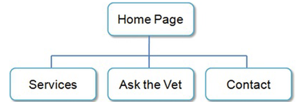
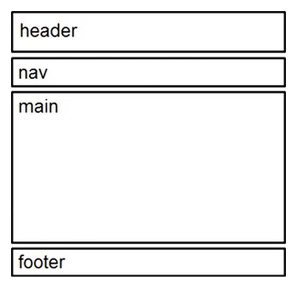
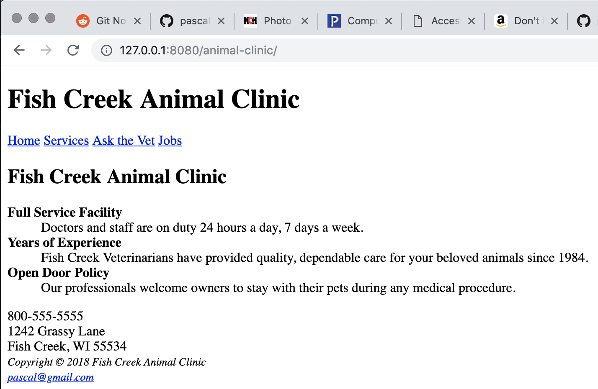

# WEBSITE CASE STUDY

## Fish Creek Animal Clinic

Magda Patel is a veterinarian and owner of the Fish Creek Animal Clinic. Her
customers are local pet owners who range from children to senior citizens.
Magda would like a website to provide information to her current and
potential customers. She has requested a:

- home page
- services page
- page for advice from a veterinarian
- contact page.

## Site Map

## Wireframe

# Completed tasks:

## Structuring the Website with HTML

1. Create a folder for the Fish Creek website.
2. Create the Home page: index.html.
3. Create the Services page: services.html.

## Result:

## Implementing CSS to embellish the website

1. Create an external style sheet that configures the
   color and text for the Fish Creek website.
2. Modify the Home page to utilize an external style sheet to configure
   colors and fonts
3. Modify the Services page to be consistent with the new Home page.
4. Configure centered page layout

## Result:
